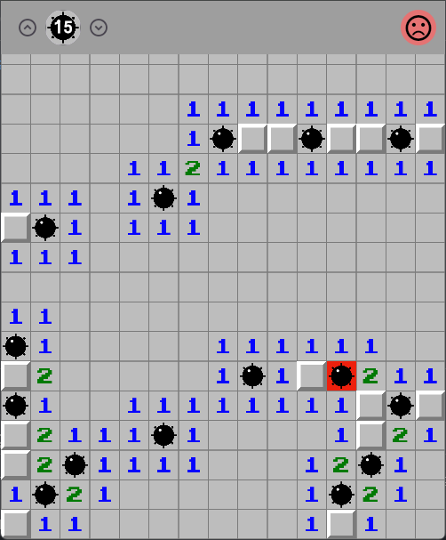

# Projeto Campo Minado em Flutter

<a href="()"></a>
[ACESSAR  CÓDIGO](https://github.com/luizzlcs/campo_minado/tree/main)

<p align="center">
 
</p>

## 🌐 Acesso ao Projeto
O projeto está disponível em: https://campominado-lcs.netlify.app/

## 📝 Descrição

Um jogo de Campo Minado (Minesweeper) desenvolvido em Flutter, com interface interativa e lógica básica de jogo.

## 🚀 Funcionalidades

---

## 🎮 Funcionalidades Principais

- **Tabuleiro interativo**:
  - Clique para revelar campos.
  - Toque longo para marcar/desmarcar minas (🚩).
  - Geração aleatória de minas no início do jogo.

- **Regras do Jogo**:
  - Derrota ao abrir uma mina (💣).
  - Vitória ao revelar todos os campos seguros.
  - Números indicam minas adjacentes.

- **Interface**:
  - Design simples com `GridView` para o tabuleiro.
  - Feedback visual em caso de vitória/derrota.

---

## 💻 Exemplos de Código

### `field.dart` (Modelo de Campo)
```dart
class Field {
  bool isOpen = false;
  bool hasMine = false;
  bool isMarked = false;
  int minesAround = 0;

  void reveal() {
    isOpen = true;
  }
}
```

## 🛠️ Tecnologias Utilizadas

- **Flutter/Dart**
- **Gestão de Estado**: `setState`
- **Layout**: `GridView`, `InkWell`
- **Componentes Customizados**
## 📁 Estrutura do Projeto

```
lib/
├── main.dart # Ponto de entrada e configuração inicial
├── components/ # Widgets personalizados
│ ├── board_widget.dart # Renderiza o tabuleiro do jogo
│ └── result_widget.dart # Exibe resultados (vitória/derrota)
└── models/ # Lógica do jogo
├── field.dart # Representa um campo individual
└── board.dart # Gerencia o tabuleiro e regras
```

## 📋 Dependências Principais

```yaml
dependencies:
  flutter: sdk: flutter
  cupertino_icons: ^1.0.6
```

## 🔧 Dependências de Desenvolvimento
```
dev_dependencies:
  flutter_test: sdk: flutter
  flutter_lints: ^3.0.0
```

## 🎨 Configuração da Interface
- Tabuleiro dinâmico com GridView

- Feedback visual imediato para ações

- Ícones intuitivos (💣 para minas, 🚩 para marcações)

## 💻 Requisitos de Desenvolvimento
SDK do Dart: '>=3.4.4 <4.0.0'

Flutter (última versão estável)

## 📄 Versão
Versão atual: 1.0.0+1


## 🚀 Como Executar

1. Clone o repositório:

``` 
git clone https://github.com/luizzlcs/campo_minado.git 
```
2. Instale as dependências:

``` 
flutter pub get
```

3. Execute o projeto:

``` 
flutter run
```

### Autor
Sou desenvolvedor fullstack, sempre buscando entregar soluções completas e eficientes, utilizando tecnologias modernas como Dart e Flutter no front-end e Java no back-end. Desde 2022, trabalho na Ponto Care, criando aplicativos para Android e Web, com foco em inovação, qualidade e garantindo a melhor experiência para o usuário.


[](https://www.linkedin.com/in/luizzlcs/)
